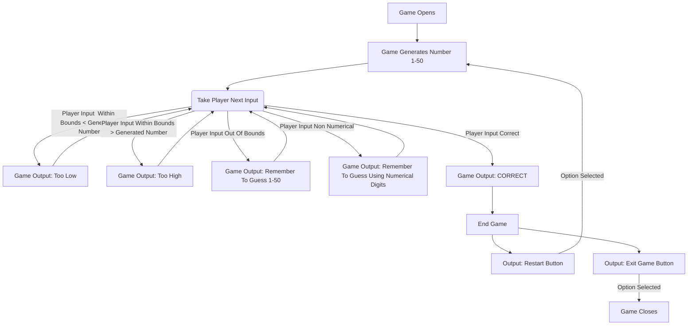

A-->C User opens game and game chooses its number randomly from the determined range, user makes first guess.
D-->G Incorrect user inputs are taken and feedback is given before sending the user back to make a new input.
H-->I Correct user input is taken, game congratulates the user and then ends.
J-->K Ended game provided options to restart or close the program. User selection between the two steps is acted out.
